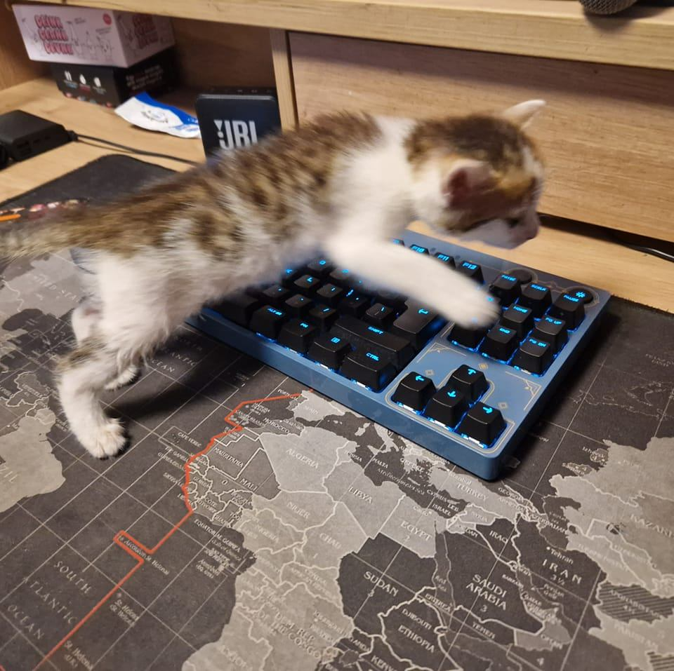

<!doctype html>
<html lang="hu">
<head>
    <meta charset="UTF-8">
    <title>Szorp</title>
    <link rel="stylesheet" href="Styles/default.css">
</head>
<body>

    

        <header class="Header"></header>

        

            

                

                    
                    
NEPTUN: P2MZHY

                    
Kukk Kristóf

                

                

                    
                    
NEPTUN: GDVK5H

                    
Kórik Edina

                

                

                    
                    
NEPTUN: TGH21X

                    
Berecz Armand

                

            

            

                

                    
                    
NEPTUN: JW8DEC

                    
Varga Olivér

                

                

                    
                    
NEPTUN: ------

                    
Bernáth Krisztián

                

            

        

    

</body>
</html>